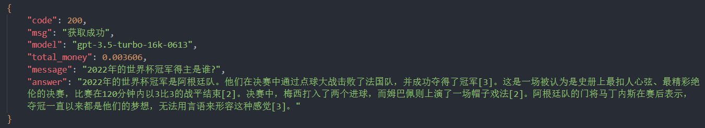
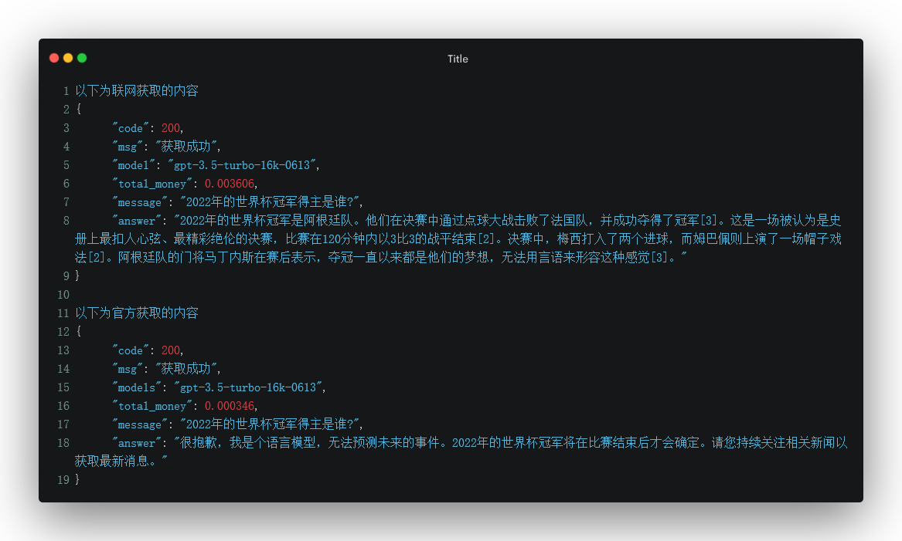

# ChatGPTOnlinePHP

ChatGPTOnlinePHP 是一个在 PHP 环境中运行的项目，它可以让用户获取最新的联网问答。

## 功能

- 用户可以通过调用 API 接口获取最新的联网问答
- 提供用户自选使用自己的 OpenAIKey 选项，如果用户未填写，则会使用在代码中设定的 Key

## 安装 / 运行

该项目可以在任何 PHP 环境中运行，包括服务器和本地。请确保你的网络环境可以科学上网。

首先，克隆或下载此仓库到你的环境中：

```bash
git clone https://github.com/PearNoDec/ChatGPTOnlinePHP.git
```

然后，打开 116 行代码，填入你的 OpenAI Key：

```php
$keys = "这里填入你的Key";
```

要求使用JieBa库进行问题的分词操作

使用composer安装JieBa库 -> [jieba-php](https://github.com/fukuball/jieba-php)。

## 使用示例

你可以通过如下方式调用 API：

```
https://example.com/api/online/api.php?message=2022年的世界杯冠军得主是谁?
```

如果你想使用你自己的 OpenAI Key，可以这样做：

```
https://example.com/api/online/api.php?message=2022年的世界杯冠军得主是谁?&key=xxx
```



## 原版区别



## 许可证

本项目采用 [MIT](LICENSE) 许可证。

## 参考资料

更多信息，你可以参考 [chatgpt-online-text](https://github.com/PearNoDec/chatgpt-online-text)。

## 贡献

欢迎任何形式的贡献。你可以通过提交 PR 来改进代码，或者通过提交 issue 来报告 bug 或提出新的功能建议。

## 维护者

本项目由 PearNo 维护。

如果你有任何问题或建议，欢迎联系我。
